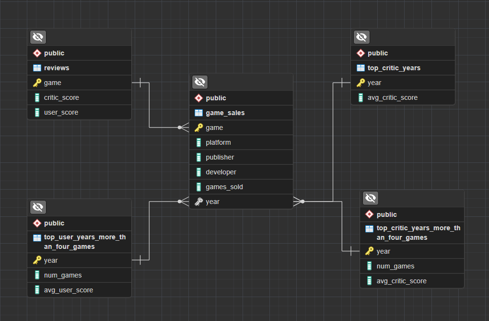
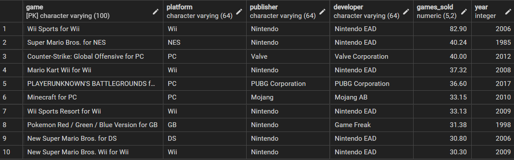
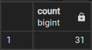
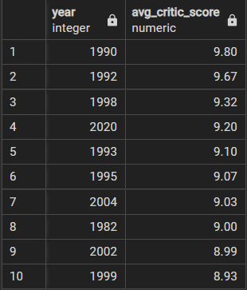
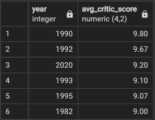
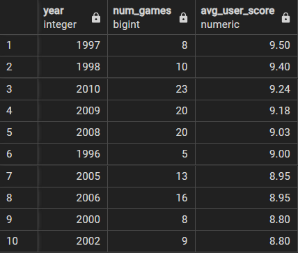
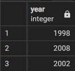
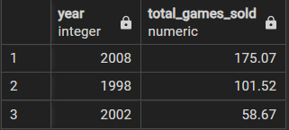

# Golden-age-of-video-games
This project analyzes critic and user ratings data, along with sales data, for the top 400 video games released since 1977. Our mission is to find a possible 'golden age' of video games, exploring the years when both critics and players were most satisfied. We will use data analysis skills, such as data set union and set theory, to achieve this.

## Requirements
- Postgresql 15
- pgAdmin 4

## Databases
ER Model



## Queries
- ## The ten best-selling video games
```
SELECT *
FROM game_sales
ORDER BY games_sold DESC
LIMIT 10;
```


- ## Missing review scores
```
SELECT COUNT(g.game)
FROM game_sales as g
LEFT JOIN reviews as r
ON g.game = r.game
WHERE critic_score IS NULL AND user_score IS NULL;
```


- ## Years that video game critics loved
```
SELECT year, ROUND(AVG(critic_score),2) AS avg_critic_score
FROM game_sales as g
LEFT JOIN reviews as r
ON g.game = r.game
GROUP BY year
ORDER BY avg_critic_score DESC
LIMIT 10;
```


- ## Was 1982 really that great?
```
SELECT g.year, COUNT(g.game) AS num_games, ROUND(AVG(r.critic_score),2) AS avg_critic_score
FROM game_sales as g
INNER JOIN reviews as r
ON g.game = r.game
GROUP BY g.year
HAVING COUNT(g.game) > 4
ORDER BY avg_critic_score DESC
LIMIT 10;
```


- ## Years that dropped off the critics' favorites list
```
SELECT year, avg_critic_score
FROM top_critic_years
EXCEPT
SELECT year, avg_critic_score
FROM top_critic_years_more_than_four_games
ORDER BY avg_critic_score DESC;
```


- ## Years video game players loved
```
SELECT g.year, COUNT(g.game) AS num_games, ROUND(AVG(r.user_score),2) AS avg_user_score
FROM game_sales as g
INNER JOIN reviews as r
ON g.game = r.game
GROUP BY g.year
HAVING COUNT(g.game) > 4
ORDER BY avg_user_score DESC
LIMIT 10;
```


- ## Years that both players and critics loved
```
SELECT year
FROM top_critic_years_more_than_four_games
INTERSECT
SELECT year
FROM top_user_years_more_than_four_games;
```


- ## Sales in the best video game years
```
SELECT g.year, SUM(g.games_sold) AS total_games_sold
FROM game_sales as g
WHERE g.year IN (SELECT year
FROM top_critic_years_more_than_four_games
INTERSECT
SELECT year
FROM top_user_years_more_than_four_games)
GROUP BY g.year
ORDER BY total_games_sold DESC;
```


## Technology Stack
- Postgresql 15
